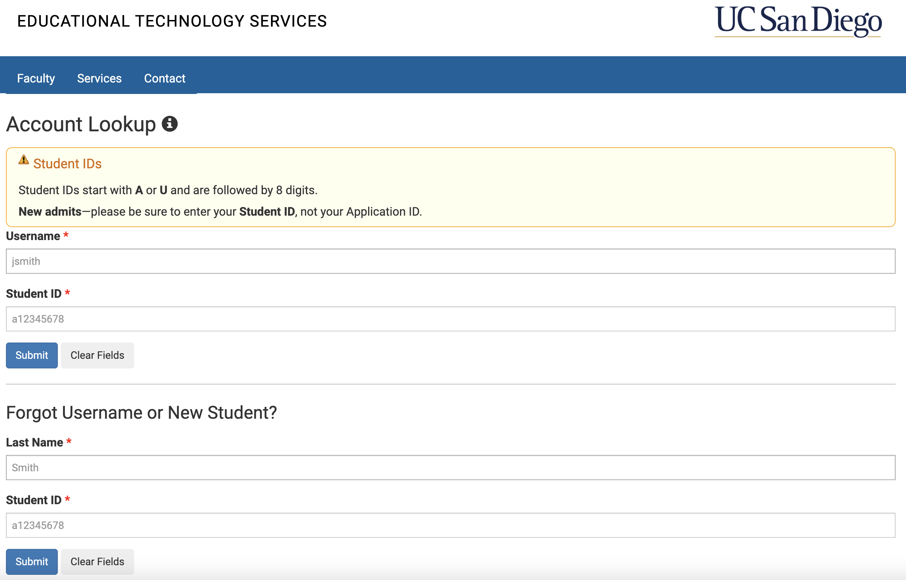
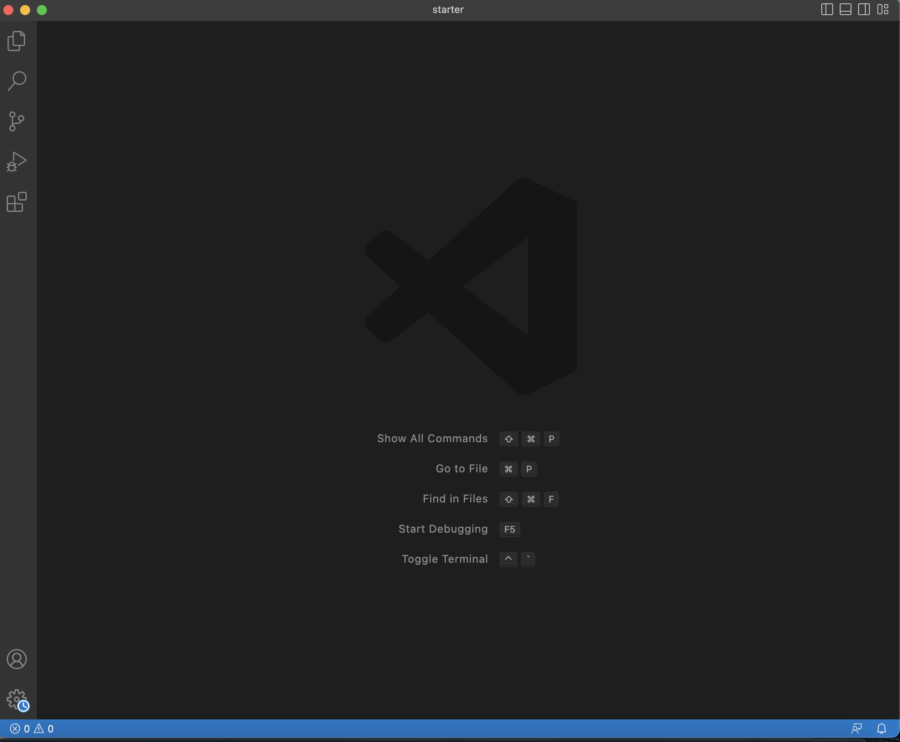
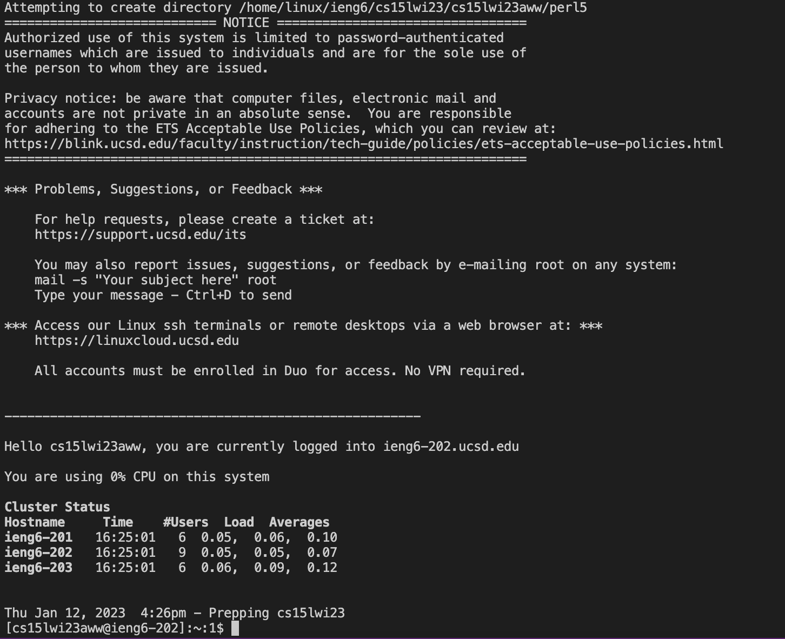

# Remote Access (Week 1 Lab Report)

1. Find Your Course Account on ETS
    - Go to the [account lookup](https://sdacs.ucsd.edu/~icc/index.php) website. It should look like this:
    
    - Follow the site's instructions
      - Enter either your UCSD username and Student ID (beginning with an A or U) or your last name and Studnet ID (under New Studnet) in the respective fields.
      - Click on the account name that is used for your course (the *second* one for me).
      - Click the change password link
      - If you know your TritonLink password (associated with you UCSD account/email), enter it in all of the password fields. If you don't, create a new password.
      - Wait a few minutes for the password to be approved and activated.
2. Installing VS Code
    - Skip these if you have already installed VS Code or have access to it on the computer you are using (I already had it installed).
    - Follow [VS Code's installation instructions](https://code.visualstudio.com/)
    - Open VS Code. It should look something like this:
    
3. Remotely Connecting
    - Open terminal in VS Code (you can drag the terminal up from the bottom of the window or click Terminal>New Terminal in the menu bar).
    - Type the following command in your terminal: `$ ssh cs15lwi23zz@ieng6.ucsd.edu` (without typing the $).
      - If you can't enter anything in your terminal, try restarting VS Code.
    - An authenticity message will appear, so type `yes` and press enter.
    - Enter your password. You should now be connected to the remote server, with a message similar to what's below.
    
4. Trying Some Commands
