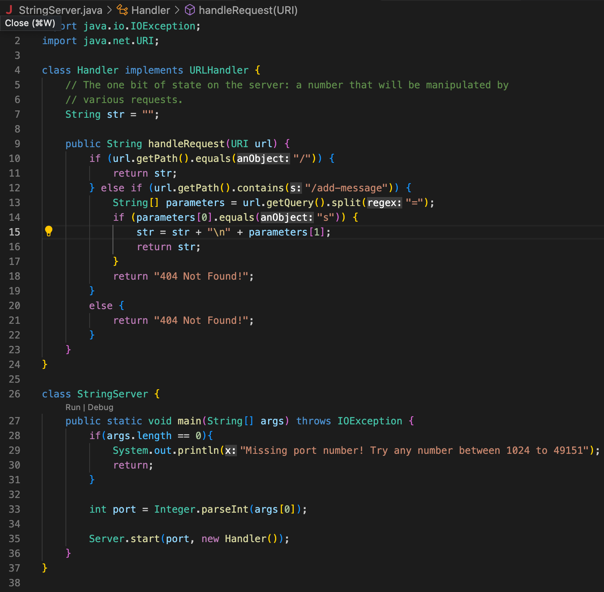
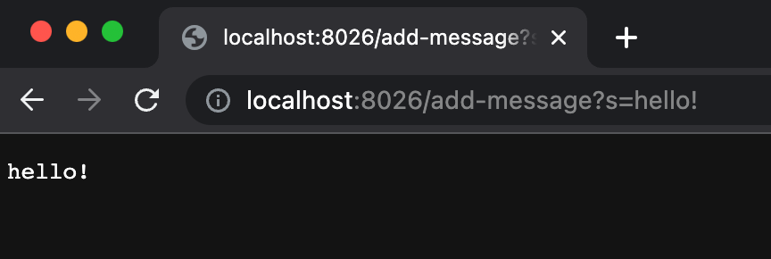
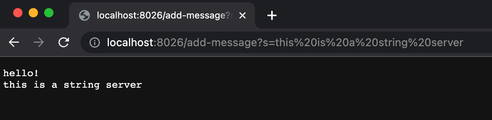

# Lab Report 2 - Servers and Bugs (Week 3)

## Part 1

- Before opening the web server in a browser, starting the server from a terminal called the Server class's `start` method. The first message, "hello!", calls the `handleRequest` method in the Handler class.
- The start method's arguments are 8026, the web server's port number, and a Handler object. The handleRequest method takes the argument https://localhost:8026/add-message?s=hello! for the url paramter. The value of str in the Handler class is "", an empty String.
- From this specific request, the parameters array is declared and initialized to `{"s", "hello!"}` and str's value is concatenated by accessing `parameters[1]`, so it changes to "\nhello!"

- The first message, "this is a string server", calls the handleRequest method in the Handler class.
- The handleRequest method takes the argument https://localhost:8026/add-message?s=this is a string server for the url paramter. The value of str in the Handler class is "\nhello!".
- From this specific request, the parameters array is declared and initialized to `{"s", "this is a string server"}` and str's value is concatenated by accessing `parameters[1]`, so it changes to "\nhello!\nthis is a string server".

## Part 2

## Part 3
From the labs in week 2 and 3, I learned that a web page can be modified simply by adjusting its URL's path and query. For instance, by using the `/add` path and adding a String in the query of my Search Engine (week 2), I was able to add elements to an ArrayList and display a different message on the web page. By using the `/search` path, I could display an array of the Strings that had been added to the Search Engine that contained the query.
