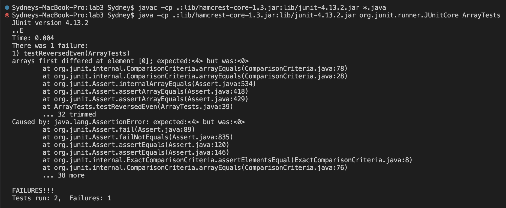
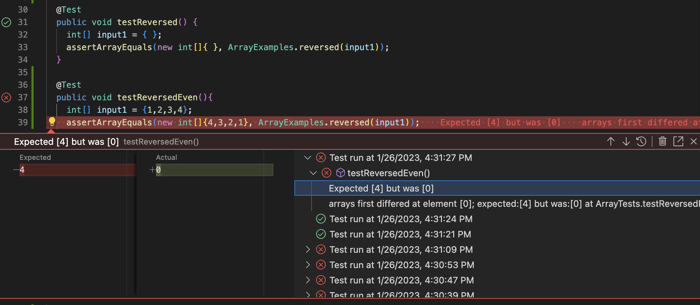

# Lab Report 2 - Servers and Bugs (Week 3)

## Part 1


- Before opening the web server in a browser, starting the server from a terminal called the Server class's `start` method. The first message, "hello!", calls the `handleRequest` method in the Handler class.
- The start method's arguments are 8026, the web server's port number, and a Handler object. The handleRequest method takes the argument https://localhost:8026/add-message?s=hello! for the url paramter. The value of str in the Handler class is "", an empty String.
- From this specific request, the parameters array is declared and initialized to `{"s", "hello!"}` and str's value is concatenated by accessing `parameters[1]`, so it changes to "\nhello!"


- The first message, "this is a string server", calls the handleRequest method in the Handler class.
- The handleRequest method takes the argument https://localhost:8026/add-message?s=this is a string server for the url paramter. The value of str in the Handler class is "\nhello!".
- From this specific request, the parameters array is declared and initialized to `{"s", "this is a string server"}` and str's value is concatenated by accessing `parameters[1]`, so it changes to "\nhello!\nthis is a string server".


## Part 2
Buggy program: `reversed(int[] arr)` in the ArrayExamples class
Failure-inducing input: `{1, 2, 3, 4}` 

```
@Test
  public void testReversedEven(){
    int[] input1 = {1, 2, 3, 4};
    assertArrayEquals(new int[]{4,3,2,1}, ArrayExamples.reversed(input1));
  }
```

Input that doesn't induce a failure: `{ }` (empty array)
```
@Test
  public void testReversed() {
    int[] input1 = { };
    assertArrayEquals(new int[]{ }, ArrayExamples.reversed(input1));
  }
```

The symptom: 
  Terminal:
  
  
  Running the individual test with failure-inducing input:
  

The bug:
   Before code change:
   ```
   static int[] reversed(int[] arr) {
     int[] newArray = new int[arr.length];
     for(int i = 0; i < arr.length; i += 1) {
       arr[i] = newArray[arr.length - i - 1];
     }
     return arr;
   }
   ```
   
   After code change:
   ```
   static int[] reversed(int[] arr) {
     int[] newArray = new int[arr.length];
     for(int i = 0; i < arr.length; i += 1) {
       newArray[arr.length - i - 1] = arr[i];
     }
     return newArray;
   }
   ```
  
The fixed code assigns each index of `newArray` to an element of `arr` in correct, reversed order by putting `newArray[arr.length - i - 1]` on the left side of the assignment operator, instead of incorrectly putting `arr[i]` on the left. This way, `newArray` gets updated to the values in reverse order. The fixed code also properly returns `newArray` instead of `arr`, so that the array that has been reversed is returned as a result of the program.
  

## Part 3
From the labs in week 2 and 3, I learned that a web page can be modified simply by adjusting its URL's path and query. For instance, by using the `/add` path and adding a String in the query of my Search Engine (week 2), I was able to add elements to an ArrayList and display a different message on the web page. By using the `/search` path, I could display an array of the Strings that had been added to the Search Engine that contained the query.
