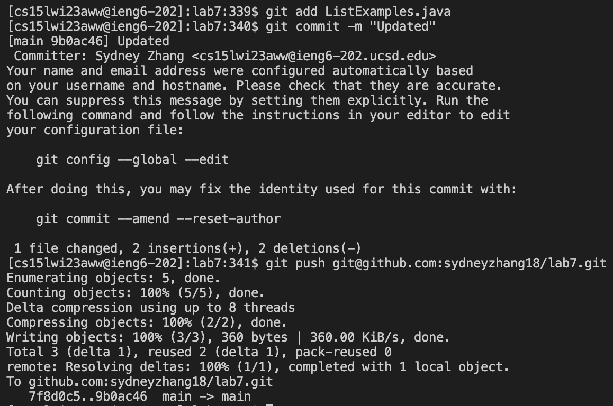

# Week 7 Lab Report

**1. Setup: Delete any existing forks of the repository you have on your account**
    
    (In my ieng6 account)
    Keys pressed: 
        `cd ..<enter>`
        `rm -r la<tab><enter>`
        `yes<enter>yes<enter>`
        `exit<enter>`
    
    I `cd` out of lab7 so I can remove it. I press tab after `la` because there are no other potential autofill possibilities. `exit` logs me out of my ieng6 account.

**2. Setup: Fork the repository**

**3. The real deal Start the timer!**

**4. Log into ieng6**
    
    Keys pressed:
        `ssh cs15lwi23aww@ieng6.ucsd.edu<enter>`
    
    I type out the entire command to log in to my ieng6 account because the terminal can't autofill my username.

**5. Clone your fork of the repository from your Github account**
    
    Keys pressed:
        `<Cmd-C>` the link of my Github repository from the browser (https://github.com/sydneyzhang18/lab7)
        `git clone <Cmd-V><enter>`
    
    To clone the lab7 repository, I type `git clone `, then copy and paste the link for efficiency.

**6. Run the tests, demonstrating that they fail**
    
    Keys pressed: 
        `cd l<tab><enter>`
        `<Cmd-C>` the junit compile command
        `<Cmd-V><enter>` the junit run command, excluding the file name
        `<Cmd-C><Cmd-V>ListExamplesTests<enter>`
    
    
    I press tab after `l` because there are no other potential autofill possibilities. I copy and paste the junit compile and run commands from the CSE 15L website, filling in the ListExamplesTests file name at the end of the run command.

**7. Edit the code file to fix the failing test**
    
    
    Keys pressed:
        `nano L<tab>.j<tab><enter>`
        `<down>` until I reach line 15 to change result.add(0, s); to result.add(s);
        `<down>` until I reach line 43 to change index1 += 1; to index2 += 1;
        `^O<enter>^X`
    
    I press tab after `L` because there are no other potential autofill possibilities, and it autofills ListExamples. I press tab again after `.j` because it exludes `.class` from the possibilities. Once I make changes to ListExamples, I press `^O<enter>` and `^X` to save the changes and exit nano.
     

**8. Run the tests, demonstrating that they now succeed**
    
    Keys pressed: 
        `<up><up><up><enter>`
        `<up><up><up><enter>`
    
    I use the up arrow to access the junit compile command that was three commands up in the command history. Then I use the up arrow again to access the junit run command, which was now three commands up in the history.

**9. Commit and push the resulting change to your Github account (you can pick any commit message!)**
    
    git add ListExamples.java
    git commit -m "Updated"
    git push git@github.com:sydneyzhang18/lab7.git
    Keys pressed:
        `git add L<tab>.j<tab><enter>`
        `git commit -m "Updated"<enter>`
        `<Cmd-C>` the lab7 repository SSH key (git@github.com:sydneyzhang18/lab7.git)
        `git push <Cmd-V><enter>`
    
    I press tab after `L` because it autofills ListExamples. I press tab again after `.j` because it exludes `.class` from the possibilities. I copy and paste the SSH key from GitHub in the next command.

